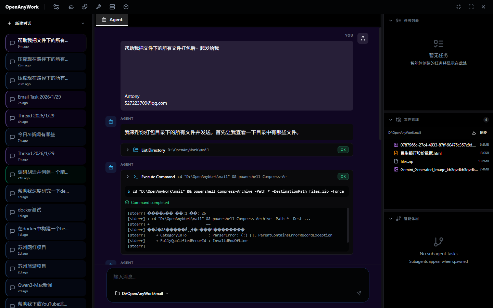
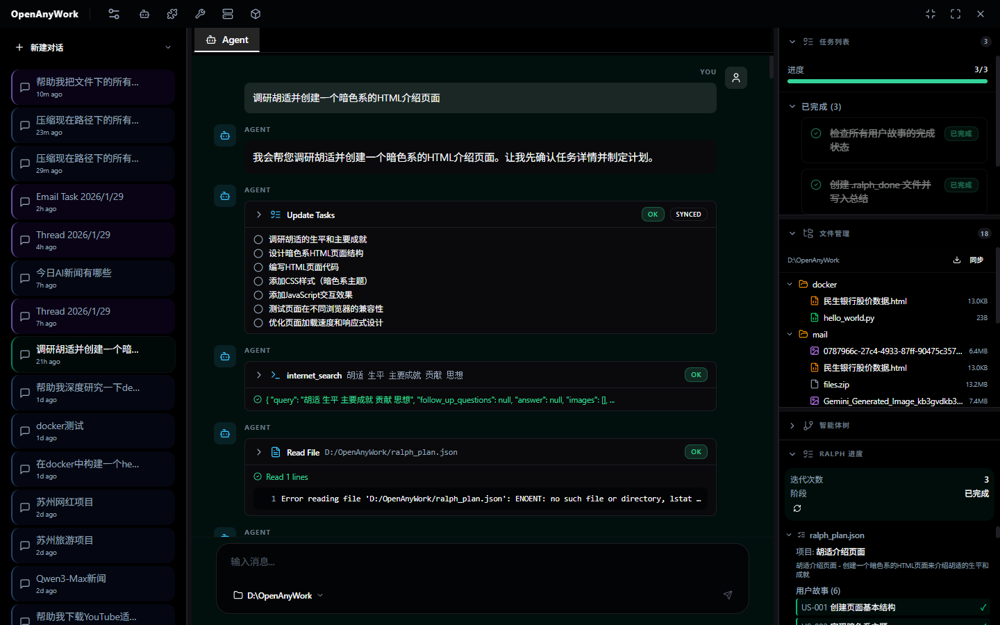
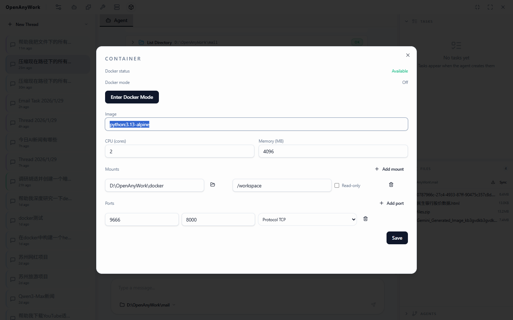

# OpenWork Deep Agent Workbench

[![npm][npm-badge]][npm-url] [![License: MIT][license-badge]][license-url]

[npm-badge]: https://img.shields.io/npm/v/openwork.svg
[npm-url]: https://www.npmjs.com/package/openwork
[license-badge]: https://img.shields.io/badge/License-MIT-yellow.svg
[license-url]: https://opensource.org/licenses/MIT

**OpenWork** 是 [deepagentsjs](https://github.com/langchain-ai/deepagentsjs) 的桌面端旗舰工作台。它不仅仅是一个聊天窗口，而是一个面向“深度代理（Deep Agent）”的生产力工具。通过集成文件系统访问、Docker 隔离环境、MCP 协议、以及强大的子智能体体系，OpenWork 让 AI 能够真正地**在你的电脑上通过工具完成复杂任务**。

> [!CAUTION]
> **警告**：OpenWork 正处于内测阶段，功能尚未完善，使用时请谨慎。






> [!CAUTION]
> **安全提示**：OpenWork 设计为让 AI 直接操作本地文件系统并执行 Shell 命令。尽管我们提供了 Docker 隔离模式，但在非隔离环境下运行命令时，请务必仔细审查每一个操作。请仅在可信的工作区（Workspace）运行。

---

## 核心交互模式

OpenWork 的设计哲学围绕着**“对话即执行”**与**“配置即能力”**展开。

### 1. 核心对话模式 (Core Conversation Mode)
这是你的主工作区。在这里，你不仅是与 AI 对话，更是在**编排任务**。
- **上下文感知**：直接读取工作区文件，理解项目结构。
- **实时执行**：AI 生成的命令、代码修改、文件操作会实时在你的机器（或 Docker 容器）中执行。
- **透明反馈**：通过流式日志看到 AI 的思考过程（Thinking）、工具调用（Tool Calls）以及执行结果。
- **多模式切换**：支持普通对话、Ralph 迭代模式、邮件助理模式等多种工作流。

### 2. 左上角设置模式 (Settings & Control Center)
点击左上角的设置图标，你将进入 Agent 的“大脑”控制中心。这里决定了 AI 的能力边界：
- **Provider 配置**：自由切换 Ollama（本地隐私模型）或 OpenAI-Compatible（DeepSeek, GPT-4, Claude 等）后端。
- **Skills (技能包)**：管理 AI 的长期记忆与专业能力。
- **MCP (Model Context Protocol)**：连接外部世界的标准接口。
- **Subagents (子智能体)**：定义和组装专精于特定领域的数字员工。

---

## 核心功能特色

### 🛡️ Docker 隔离沙箱
为了安全地运行 AI 生成的代码和脚本，OpenWork 内置了 Docker 支持（目前主要支持 Windows，需要已经安装docker）。
- **线程级容器**：每个任务线程可以拥有独立的容器环境。
- **安全挂载**：仅将当前工作区挂载到容器内，隔离宿主机敏感数据。
- **资源限制**：可配置 CPU 和内存限制，防止失控。

### 🔌 MCP (Model Context Protocol) 集成
全面支持 MCP 协议，让 Agent 的工具库无限扩展。
- **自动发现**：支持本地和远程 MCP Server。
- **即插即用**：配置好 Server 后，Agent 即可自动获得新的工具（如数据库访问、API 操作等）。
- **状态监控**：实时查看 MCP 服务的运行状态。

### 🤖 Subagent 子智能体体系
不再是一个通用的 AI 做所有事。你可以定义“子智能体”：
- **角色定制**：为不同的任务（如“前端专家”、“运维工程师”）设定专属 System Prompt。
- **工具授权**：仅赋予子智能体完成任务所需的特定工具或 MCP 能力。
- **Middleware**：支持中间件扩展，实现更复杂的逻辑控制。

### 🧠 Skills 技能系统
通过 Markdown (`SKILL.md`) 定义技能，让 AI 能够“学会”新的流程。
- **本地管理**：在 `.openwork/skills` 目录下直接编辑技能文件。
- **动态加载**：Agent 可以根据任务需求动态检索和加载相关技能。

### 🔄 RALPH 迭代模式
这是 OpenWork 的一种高级自主模式，专为解决复杂长程任务设计。
1. **计划生成**：Agent 首先生成 `ralph_plan.json`，规划任务步骤。
2. **人机确认**：用户输入 `/confirm` 批准计划。
3. **循环执行**：Agent 自主循环执行任务，更新 `progress.txt`，直到完成目标。适合代码重构、大型文档撰写等任务。

### 📧 邮件助理模式
将 Agent 接入你的通信流，参考 [EMAIL.md](EMAIL.md)。
- **双向同步**：通过 IMAP 监听特定标签（如 `<OpenworkTask>`）的邮件任务。
- **自动处理**：Agent 自动拉取任务，执行后回复处理摘要。
- **异步协作**：你可以在手机上发邮件给 Agent 布置任务，回家直接看结果。

---

## 未来计划 (Roadmap)

OpenWork 正在快速演进，我们致力于打造最强大的本地 AI 工作台：

### 👁️ 接入多模态 (Multi-modal Support)
- **视觉能力**：让 Agent 能够“看”到你的屏幕截图、设计稿或报错图片，并据此编写代码或提供建议。
- **语音交互**：支持语音输入指令，甚至让 Agent 语音汇报工作进度。

### 🌐 接入浏览器操作工具 (Browser Automation)
- **Headless & GUI**：集成 Puppeteer/Playwright，让 Agent 能够自动控制浏览器进行网页测试、数据抓取、表单填写等操作。
- **网页理解**：将网页内容转化为 Agent 易于理解的结构化数据。

### 📄 更多文档解析工具 (Advanced Document Parsing)
- **办公文档**：原生支持 PDF, Word, Excel, PowerPoint 等格式的深度解析与生成。
- **知识库构建**：从本地文档目录自动构建向量索引，让 Agent 拥有私有知识库。

### 🚀 更多开放特性 (Free to Play)
- **插件市场**：建立社区驱动的 Skills 和 Subagents 市场，一键安装他人的最佳实践。
- **本地模型优化**：针对 Ollama 等本地运行环境进行深度适配，让普通电脑也能跑出高质量 Agent。
- **跨设备同步**：通过 P2P 或云端同步你的 Agent 配置与记忆。

---

## 快速开始

### 安装

目前仅为内测版，请使用源码安装和启动。

### 源码开发

如果你想参与贡献或进行二次开发：

```bash
git clone https://github.com/Antony-Jia/OpenAnyWork.git
cd openwork
npm install

# 启动开发模式
npm run dev
```

---

## 配置说明

OpenWork 的所有用户配置数据存储在用户主目录下的 `.openwork` 文件夹中：

- `provider-config.json`: 模型连接配置。
- `settings.json`: 全局应用设置（RALPH, 邮件等）。
- `subagents.json`: 子智能体定义。
- `mcp.json`: MCP 服务器配置。
- `skills/`: 自定义技能包目录。

---

## 贡献

欢迎提交 Issue 和 Pull Request！让 OpenWork 变得更好。
请参阅 [CONTRIBUTING.md](CONTRIBUTING.md) 了解详情。

## 许可证

[MIT](LICENSE) © LangChain
